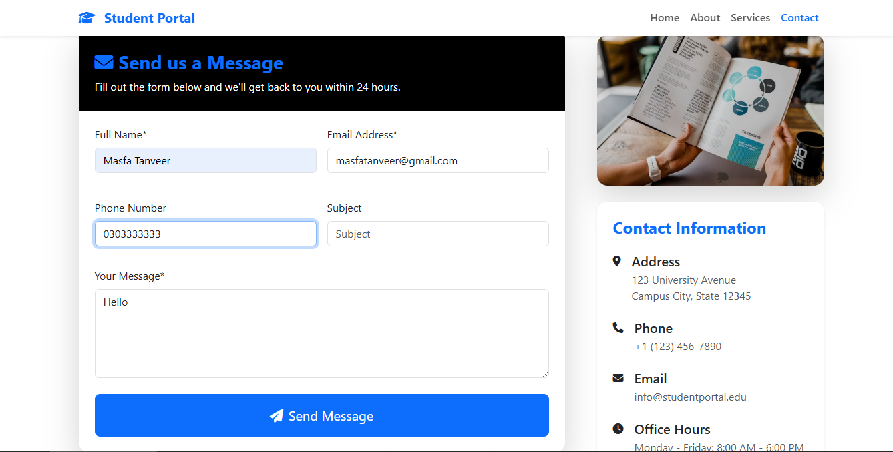

# 🎓 Django Student Portal – Smart & Responsive UI

A modern Django-based **Student Portal Web App** built with clean code, responsive UI, and functional pages (Home, About, Services, Contact). Integrated with **Crispy Forms**, class-based views, Bootstrap 5, and professional templates.

> ✨ Perfect for portfolios, academic demos, or beginner Django deployments.

---

## 🛠 Tech Stack

| Feature           | Technology        |
|------------------|-------------------|
| Backend           | Python, Django    |
| UI Framework      | Bootstrap 5       |
| Forms             | Django Crispy Forms + crispy-bootstrap5 |
| Template Engine   | Django Templates  |
| Styling           | Custom CSS        |
| Admin Panel       | Django Admin      |

---

## 📦 Features

- ✅ Clean UI with mobile-friendly responsive layout  
- ✅ Functional Pages: Home, About, Services, Contact  
- ✅ Class-based views for better structure  
- ✅ Form validation using `ModelForm`  
- ✅ Dynamic alerts with Django messages  
- ✅ Admin panel with search, filter & inline editing  
- ✅ SEO-ready template structure  
- ✅ Crispy Bootstrap 5 Form integration  
- ✅ Ready for deployment & customization  

---

## 🔧 How to Run Locally

### 1. Clone the Repo

```bash
git clone https://github.com/masfaatanveerr/Student-Portal-Django.git
cd Student-Portal-Django
```

### 2. Create Virtual Env (Optional but Recommended)

```bash
python -m venv venv
venv\Scripts\activate     # Windows
# OR
source venv/bin/activate  # Mac/Linux
```

### 3. Install Requirements

```bash
pip install django django-crispy-forms crispy-bootstrap5
```

### 4. Run Migrations

```bash
python manage.py makemigrations
python manage.py migrate
```

### 5. Start the Server

```bash
python manage.py runserver
```

### 6. Access App

- Home Page: http://127.0.0.1:8000/  
- Admin Panel: http://127.0.0.1:8000/admin/  
  (Create superuser via `python manage.py createsuperuser`)

---

## 📁 Project Structure

```
django-basics/
├── crm1/               ← Django project settings
├── home/               ← App with models, views, urls
├── static/             ← Static assets (images, css)
├── template/           ← Bootstrap HTML templates
├── manage.py
└── README.md
```

---

## 📸  

> Contact Form with Validation  


---

## 💡 Credit & License

Developed by **Masfa Tanveer**  
MIT License — _free to use, modify, and distribute_

---

## 💬 Contact

> For custom versions, help, or deployment:  
**masfaatanveer@gmail.com**

---

